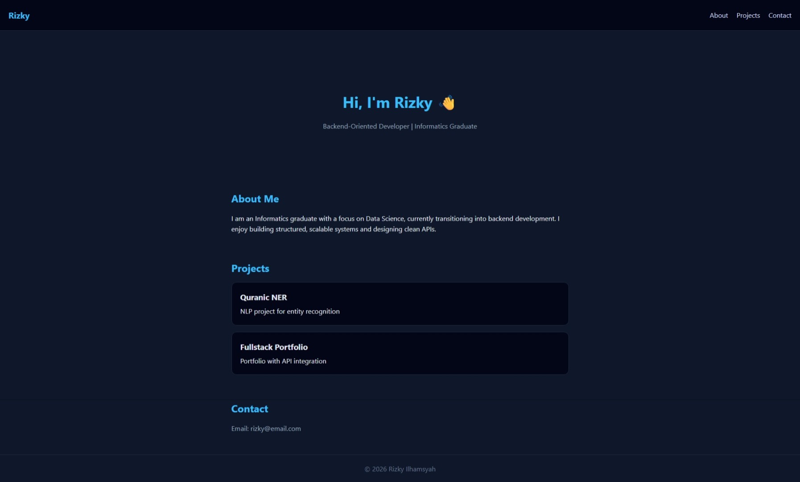
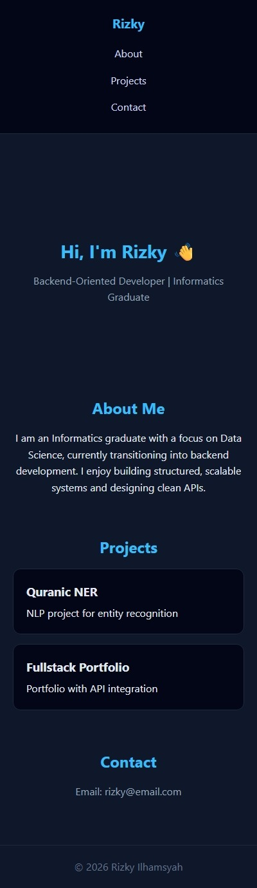

# 04 - Results & Reflection

## ✅ Hasil Akhir
Project berhasil menghasilkan:
- Website portfolio berbasis fullstack (frontend + backend API)
- Data project ditampilkan secara dinamis melalui REST API
- Struktur code yang modular dan terpisah antara frontend dan backend

---

## 📸 Screenshot

### Desktop

### Mobile

---

## 📊 Evaluasi Teknis

### Kelebihan
- Menggunakan pendekatan API-driven (data tidak hardcoded)
- Separation of concerns antara frontend dan backend
- Struktur project rapi dan mudah dikembangkan
- Menggunakan semantic HTML

### Kekurangan
- Masih menggunakan JSON sebagai penyimpanan data (belum database)
- Belum ada authentication
- Error handling masih minimal
- Belum di-deploy ke production

---

## 🔧 Penyesuaian Struktur

Dilakukan penyesuaian struktur project dengan memindahkan file frontend ke root directory agar kompatibel dengan GitHub Pages.

---

## 🧠 Refleksi

Dari project ini saya memahami bahwa:
- AI dapat mempercepat proses development, tetapi tetap memerlukan evaluasi manual
- Struktur dan maintainability lebih penting dibanding hanya menghasilkan output cepat
- Pendekatan backend (modular & scalable) dapat diterapkan bahkan pada project sederhana

---

## 🚀 Pengembangan Selanjutnya
- Menggunakan database seperti MongoDB atau PostgreSQL
- Menambahkan authentication (JWT)
- Implementasi CRUD lengkap
- Menambahkan validasi dan error handling
- Deploy ke platform cloud (Render / Railway)

---

## 🎯 Kesimpulan
Project ini menunjukkan bahwa dengan pendekatan yang terstruktur dan penggunaan AI yang tepat, sebuah project sederhana dapat mencerminkan kemampuan engineering yang baik, terutama dalam konteks backend development.